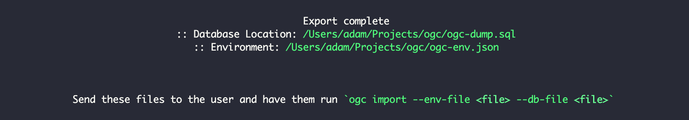
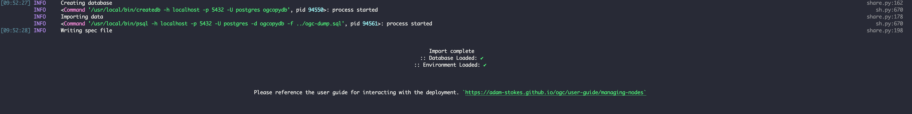
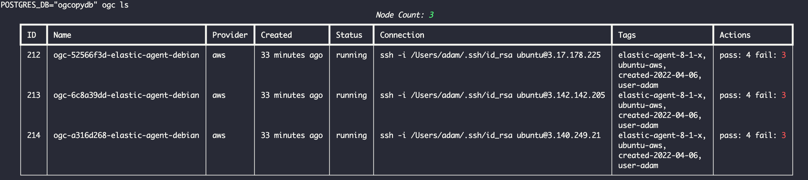

# Sharing Environment

OGC provides a way to share an environment with another user, they are facilitated through the `ogc export-env` and `ogc import-env` commands. 
This document will walk through how to accomplish this plus any caveats to be aware of.

## Exporting

First, we need to export the current environment. This will dump the database of node information, 
the environment variables used in the deployment, and will include the public ssh key of the shared user on all nodes.

The person you are sharing with should provide you with a passwordless public ssh key. This can either be the 
contents of the public ssh key or a GitHub username that has public ssh keys associated with their profile.

``` sh
$ ogc export-env

How would you like to import the users public ssh key [github/manual] (github): 
Please enter your Github username: adam-stokes
```

Once the export is complete it will print out the results including some instructions on what to do next



## Importing

Once the user has both the database `ogc-dump.sql` and the environment `ogc-env.json` they will need to import that on their machine.

!!! caution
    If the user already has `ogc` installed and a deployment created, they may want to keep that information intact. To avoid overwriting
    the users database during import make sure to prefix the command with `POSTGRES_DB`:

    ``` sh
    $ POSTGRES_DB="ogcopydb" ogc import-env
    ```

    Also, the import command will automatically write to files `ogc.yml` and `.env`. If those files already exist in the directory where the import command is run
    then you will want to do one of two things:

    * Create a backup of those files
    * Run `ogc import-env` from a different directory, perhaps creating a temporary directory for working with the shared environment.

To do the import run the following:

``` sh
$ POSTGRES_DB="ogcopydb" ogc import-env --env-file ../ogc-env.json \
        --db-file ../ogc-dump.sql \
        --private-ssh-key ~/.ssh/id_rsa \
        --public-ssh-key ~/.ssh/id_rsa.pub
```

The `private-ssh-key` and `public-ssh-key` should be the locations of the keys associated with the one shared during export.



Once import is complete, you can access this environment:

``` sh
$ POSTGRES_DB="ogcopydb" ogc ls
```



!!! Warning
    The cloud credentials are not copied over, you will need to setup your credentials again in the newly created `.env`. You will need to make sure that the correct project/region is set and accessible by your cloud account.